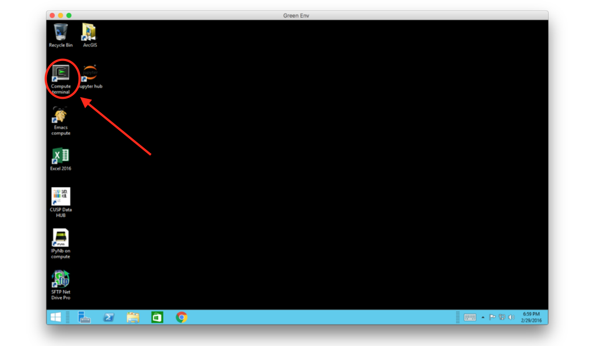

_compute_  is the name of a machine (a computer) which is accessible to all CUSP students (and anyone with a CUSP id). 
You can see all the CUSP computational resources [here](https://datahub.cusp.nyu.edu/computing.html#computing_resources).

If you scroll down you will see the specifications for _compute_. The full path is _compute.cusp.nyu.edu_.

Instructions to access _compute_ are [here](https://datahub.cusp.nyu.edu/computing.html#accessing_the_workspace)

The easiest way is to access it with _ssh_, if you have a machine with a terminal (e.g. if your laptop is a mac) by typing

```
ssh -X -A -t cuspid@gw.cusp.nyu.edu ssh -A -X compute
```
    
using your cuspid (typically the same as your netID), or by accessing the CUSP Data Facilty Green Environment with your remote desktop and using the compute shell there:


Similar instructions are also in the [slides](https://github.com/fedhere/UInotebooks/tree/master/slides) (slide 38 and 39), and you can contact the [DataFacilty](https://datahub.cusp.nyu.edu/services.html) with access issues.

Note: the _Green Environment_ is the portion of the CUSP [Data Facility](https://datahub.cusp.nyu.edu/) that hosts green, i.e. non access restricted, data. Because the data is green the Green Environment can talk to the rest of the world through the internet, and you can synchronize your repositories with [GitHub](http://www.github.com). However __scp__ and __rsync__ as methods to move files into and out of _compute_ are not allowed. Instead you can use [__wget__](https://www.gnu.org/software/wget/manual/wget.html) to grep files from the internet, and [__sftp__](https://www.digitalocean.com/community/tutorials/how-to-use-sftp-to-securely-transfer-files-with-a-remote-server) to move file in and out going through another machine called _staging_  (staging.cusp.nyu.edu). _staging_ has the same file system mounted as _compute_, so when you __sftp__ something to _staging_ it is also available on _compute_, but _staging_ is in comunication with the world through sftp, while _compute_ is not.

NOTE:  when you log into the CUSP machines (for example with bitwise) you must make sure you are making it all the way to _compute_, which is a machine: __compute.cusp.nyu.edu__ . The port of ingress to all CUSP machines is _gateway_ (__gw.cusp.nyu.edu__) but that is not a machine you can you can work on, because nothing is installed on it. If you are on gw (the prompt will tell you) you must type the command
 
```
ssh compute 
```

Before you try to create a directory, edit a file, or whatever else.
